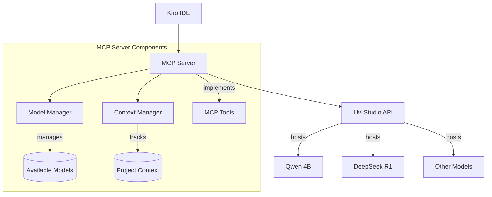
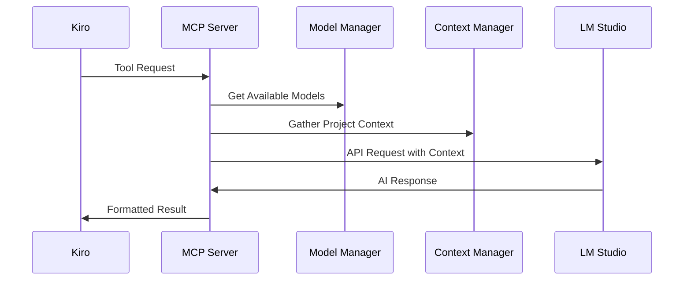

# Design Document

## Overview

The LM Studio MCP Integration creates a Model Context Protocol server that bridges Kiro with LM Studio's local AI models. The server implements the MCP specification to provide seamless AI assistance through standardized tool interfaces while managing multiple models and maintaining persistent connections.

## Architecture

### High-Level Architecture



### Component Interaction Flow



## Components and Interfaces

### 1. MCP Server Core

**Responsibilities:**
- Implement MCP protocol specification
- Handle tool registration and discovery
- Manage client connections from Kiro
- Route requests to appropriate handlers

**Key Interfaces:**
```typescript
interface MCPServer {
  initialize(): Promise<void>
  registerTools(): void
  handleRequest(request: MCPRequest): Promise<MCPResponse>
  shutdown(): Promise<void>
}
```

### 2. Model Manager

**Responsibilities:**
- Discover available models in LM Studio
- Handle model selection and switching
- Manage model-specific configurations
- Provide model capability information

**Key Interfaces:**
```typescript
interface ModelManager {
  discoverModels(): Promise<Model[]>
  selectModel(modelId: string): Promise<void>
  getCurrentModel(): Model
  getModelCapabilities(modelId: string): ModelCapabilities
}

interface Model {
  id: string
  name: string
  type: string
  contextWindow: number
  capabilities: string[]
}
```

### 3. LM Studio API Client

**Responsibilities:**
- Maintain persistent connection to LM Studio
- Handle API authentication and requests
- Implement retry logic and error handling
- Manage request/response formatting

**Key Interfaces:**
```typescript
interface LMStudioClient {
  connect(endpoint: string): Promise<void>
  sendRequest(prompt: string, options: RequestOptions): Promise<string>
  listModels(): Promise<Model[]>
  loadModel(modelId: string): Promise<void>
  isConnected(): boolean
}
```

### 4. Context Manager

**Responsibilities:**
- Gather relevant project context
- Implement intelligent context windowing
- Maintain conversation history
- Handle context prioritization

**Key Interfaces:**
```typescript
interface ContextManager {
  gatherProjectContext(workspacePath: string): Promise<ProjectContext>
  buildPromptContext(request: string, context: ProjectContext): string
  updateContext(newContext: Partial<ProjectContext>): void
  pruneContext(maxTokens: number): void
}
```

### 5. MCP Tools

**Core Tools to Implement:**

1. **code-analyze**: Analyze code quality, patterns, and issues
2. **code-generate**: Generate code based on specifications
3. **code-explain**: Explain complex code sections
4. **code-refactor**: Suggest refactoring improvements
5. **model-switch**: Change the active model for subsequent requests
6. **model-list**: List all available models and their capabilities

## Data Models

### Configuration Model
```typescript
interface ServerConfig {
  lmStudioEndpoint: string
  defaultModel: string
  maxContextTokens: number
  reconnectAttempts: number
  reconnectDelay: number
  logLevel: 'debug' | 'info' | 'warn' | 'error'
}
```

### Request/Response Models
```typescript
interface CodeAnalysisRequest {
  code: string
  language: string
  analysisType: 'quality' | 'security' | 'performance' | 'all'
  modelId?: string
}

interface CodeGenerationRequest {
  specification: string
  language: string
  context?: ProjectContext
  modelId?: string
}

interface MCPToolResponse {
  success: boolean
  data?: any
  error?: string
  modelUsed: string
}
```

### Project Context Model
```typescript
interface ProjectContext {
  workspacePath: string
  activeFiles: FileContext[]
  projectStructure: DirectoryTree
  dependencies: Dependency[]
  gitContext?: GitContext
}

interface FileContext {
  path: string
  content: string
  language: string
  relevanceScore: number
}
```

## Error Handling

### Connection Management
- Implement exponential backoff for LM Studio reconnection
- Graceful degradation when LM Studio is unavailable
- Clear error messages for configuration issues
- Timeout handling for long-running requests

### Model Management
- Fallback to default model when requested model unavailable
- Validation of model capabilities before request processing
- Clear feedback when model switching fails
- Context size validation before sending requests

### Request Processing
- Input validation for all tool requests
- Structured error responses following MCP specification
- Request timeout and cancellation support
- Context overflow handling with intelligent truncation

## Testing Strategy

### Unit Tests
- Model Manager: Model discovery, selection, and capability checking
- Context Manager: Context gathering, windowing, and prioritization
- LM Studio Client: Connection handling, request formatting, error scenarios
- MCP Tools: Individual tool functionality and error handling

### Integration Tests
- End-to-end MCP protocol communication
- LM Studio API integration with multiple models
- Context management across multiple requests
- Error recovery and reconnection scenarios

### Performance Tests
- Context processing performance with large codebases
- Model switching latency
- Concurrent request handling
- Memory usage with extended conversations

### Manual Testing Scenarios
1. Fresh installation and configuration
2. Model switching during active development session
3. LM Studio restart during active session
4. Large project context handling
5. Multiple concurrent Kiro instances